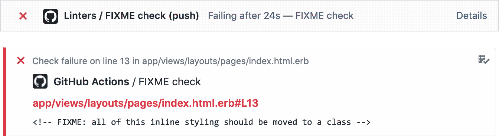

# action-fixme-check

Checks the code base for any terms ending with a colon, and fail the check if
any are found. The default term is `FIXME:`. You can add or change the terms
using the `term` parameter, see [Installation](#Installation) below.
Useful if you want to make sure that you don't miss any required changes in the
code base before merging a PR.

It runs very fast, taking only a few seconds to finish even on a very large
codebase. All files in the repository will be read, including binary files (it
uses `git grep` under the hood).

In your checks list and PR, you get helpful annotations like this:



## Installation

Edit or create a workflow `.yml` file in `.github/workflows` folder of your repository.

Here's an example of a `linters.yml` workflow.

```yml
name: Linters

on: [push]

jobs:
  fixmes:
    name: FIXME check
    runs-on: ubuntu-latest
    steps:
    - uses: actions/checkout@v1
    - uses: bbugh/action-fixme-check@master # or @ the latest release
      with:
      	terms: 'WIP|FIXME' # optional, defaults to `FIXME`
      	case-sensitive: false  # optional, defaults to `false`
```

## Support

- [Official workflow configuration docs](https://help.github.com/en/actions/automating-your-workflow-with-github-actions/workflow-syntax-for-github-actions)

## Testing words

(Used for testing this action on itself.)

- I am using `WIP:` here.
- I am using `FIXME:` here.
- Nothing to see here.
- I am using `FIX:` here.
- I am using `wip:` here.
- I am using `fixme:` here.

## License

The `action-fixme-check` library is available as open source under the terms of
the [MIT License](http://opensource.org/licenses/MIT). This license means you
can use it however you want, as long as you give me credit. Praise and adoration
is optional, but encouraged.
